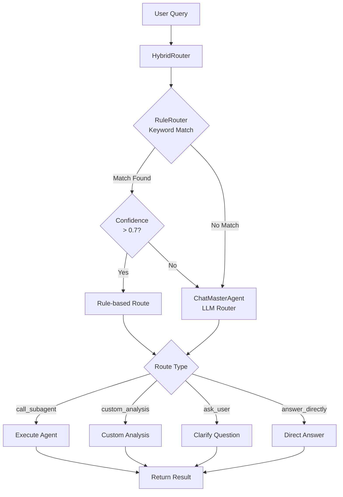
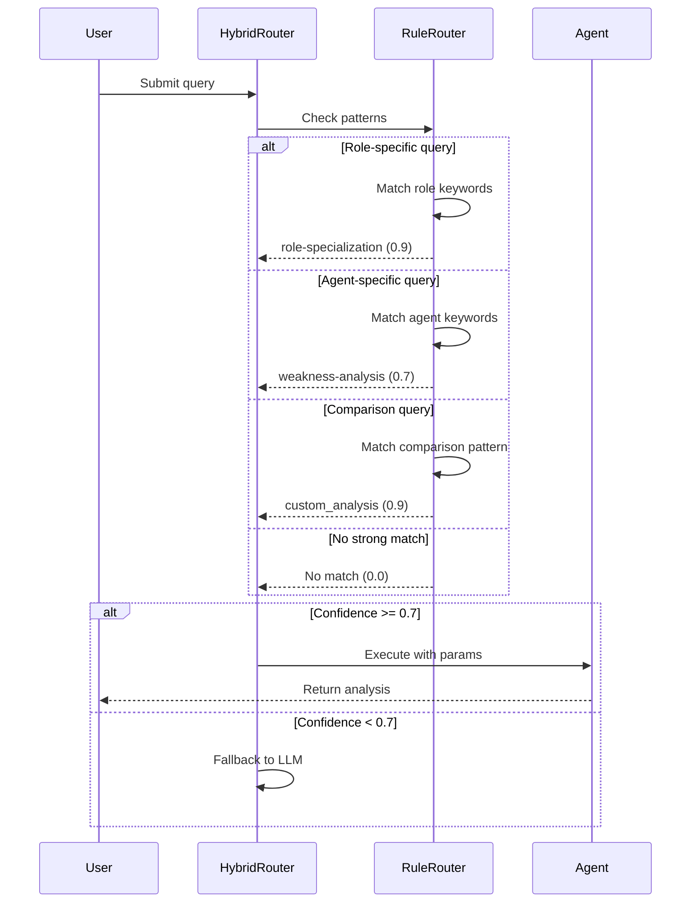
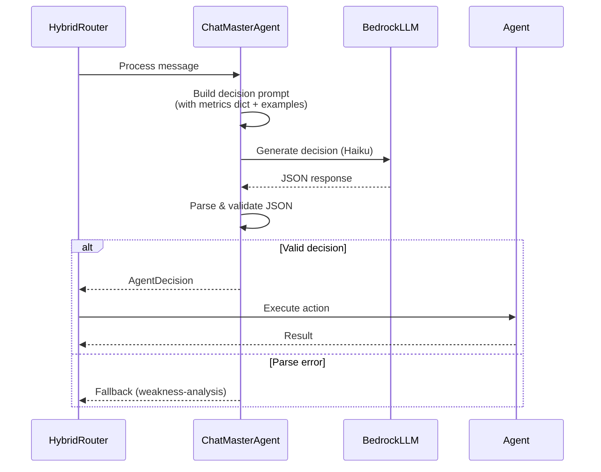

# Hybrid Routing System Flow

## Overview

The hybrid routing system combines rule-based pattern matching with LLM intelligence to route user queries to appropriate analysis agents.

## System Architecture



## Detailed Flow

### 1. Rule-based Routing (Fast Path)



### 2. LLM Routing (Intelligent Path)



## Route Decision Types

### 1. call_subagent
Route to specific analysis agent with parameters.

**Example:**
```json
{
  "action": "call_subagent",
  "subagent_id": "role-specialization",
  "params": {"role": "JUNGLE"},
  "reason": "User asks about jungle performance"
}
```

### 2. custom_analysis
Trigger comparative analysis (time periods, roles, champions).

**Example:**
```json
{
  "action": "custom_analysis",
  "reason": "Time period comparison detected"
}
```

### 3. ask_user
Request clarification with options.

**Example:**
```json
{
  "action": "ask_user",
  "content": "Which aspect would you like to analyze?",
  "options": ["Weaknesses", "Role performance", "Champion mastery"],
  "reason": "Query too broad"
}
```

### 4. answer_directly
Simple data question answered from player context.

**Example:**
```json
{
  "action": "answer_directly",
  "content": "You have played 150 games total.",
  "reason": "Simple factual question"
}
```

## Rule Patterns

### Role Detection
- **TOP**: top, toplane, 上单, 上路, baron lane
- **JUNGLE**: jungle, jg, 打野, 野区
- **MID**: mid, midlane, 中单, 中路
- **ADC**: adc, ad, bot lane, 下路, marksman
- **SUPPORT**: support, sup, 辅助

### Agent Keywords
- **weakness-analysis**: weakness, 弱点, improve, 提升
- **champion-recommendation**: recommend, 推荐, suggest, 英雄
- **annual-summary**: season, 赛季, annual, 年度, summary
- **version-trends**: patch, 版本, meta, 趋势
- **build-simulator**: build, 出装, item, 装备

### Comparison Patterns
- "compare X vs Y" / "对比 X 和 Y"
- "last 30 days vs previous 30 days"
- "weekend vs weekday"
- "first 50 games vs last 50 games"

## Metrics Constraint

The LLM router is constrained to use only these **20 quantitative metrics**:

**Behavioral (5):**
- pick_rate, attach_rate, rune_diversity, synergy_score, counter_effectiveness

**Win Rate (5):**
- baseline_winrate, ci_lower, ci_upper, effective_n, governance

**Objective (3):**
- objective_rate, baron_rate, dragon_rate

**Economic (3):**
- item_efficiency, gold_per_min, cs_efficiency

**Combat (4):**
- combat_power, damage_efficiency, time_to_core, shock_impact

**Additional:**
- kda, kda_adj, damage_dealt, damage_taken, vision_score, cs, gold_earned

## Performance Characteristics

### Rule Router
- **Speed**: < 1ms (keyword matching)
- **Accuracy**: 73%+ on clear patterns
- **Languages**: English + Chinese
- **Confidence range**: 0.6 - 0.95

### LLM Router (Haiku)
- **Speed**: 2-5 seconds
- **Accuracy**: High on complex queries
- **Cost**: ~$0.0001 per query
- **Fallback**: Always available

## Usage Example

```python
from src.agents.chat.router import get_hybrid_router

# Initialize router
router = get_hybrid_router(
    rule_confidence_threshold=0.7,
    llm_model="haiku"
)

# Route user query
result = router.route(
    user_message="How is my recent jungle performance?",
    session_history=[],
    player_data={"total_games": 150, "patches": ["15.17", "15.18"]}
)

# Result
# -> routing_method: "rule"
# -> action: "call_subagent"
# -> subagent_id: "role-specialization"
# -> params: {"role": "JUNGLE"}
# -> confidence: 0.9
```

## Test Coverage

**Test Suite**: 15 representative queries
- Simple role queries (EN + CN)
- Agent-specific requests
- Comparison queries
- Ambiguous queries (LLM fallback)
- Simple data questions

**Pass Rate**: 73.3% (11/15 tests)

## Next Steps

1. ✅ Implement hybrid routing logic
2. ✅ Add comprehensive testing
3. 🔄 SSE streaming integration
4. 🔄 Frontend chat interface
5. 📊 Routing analytics & monitoring
